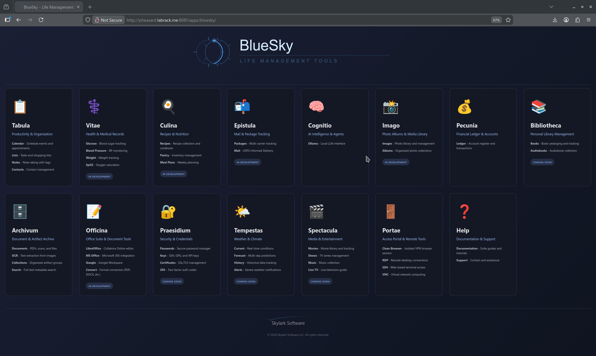
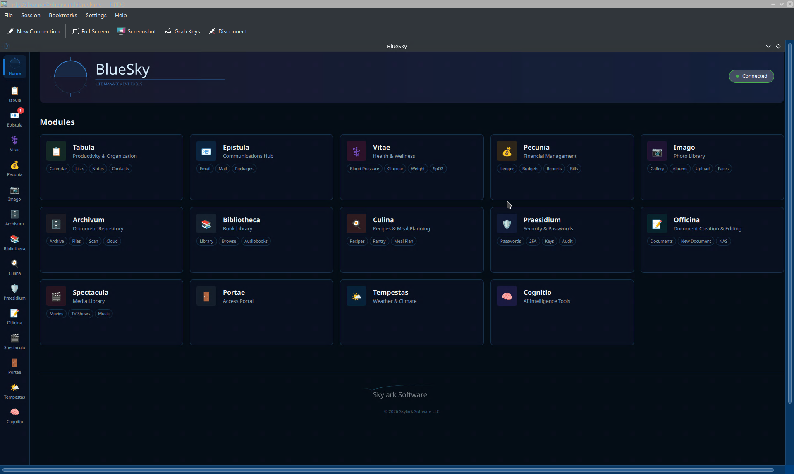
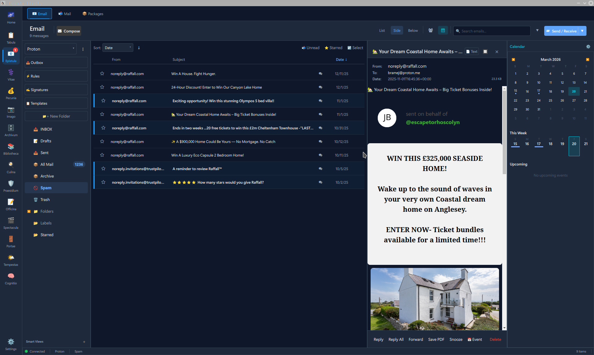
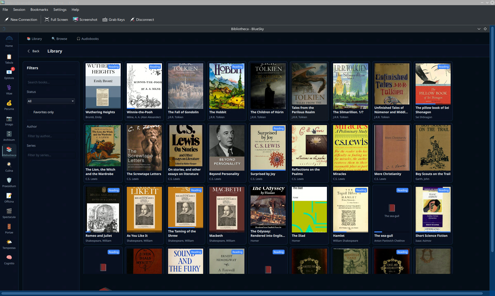

# BlueSky — Life Management Tools

A sovereign-cloud alternative to NextCloud — self-hosted or cloud-hosted, with zero footprint on your devices.

## Overview

BlueSky is a self-hosted personal productivity platform with 14 integrated modules covering tasks, email, calendar, documents, photos, recipes, finance, health tracking, security, and more.

## Key Features

- **Self-hosted sovereignty** — deploy with Docker, HTTPS reverse proxy, and Tailscale. Your data never leaves your infrastructure
- **Zero-footprint web client** — works on any device including mobile. Delete the bookmark and nothing exists on your phone
- **Native desktop client** — Qt6/C++ cross-platform app for Linux, Windows, and macOS

## Modules

| Module | Description |
|--------|-------------|
| **Tabula** | Productivity — Calendar, Lists, Notes, Contacts |
| **Epistula** | Communications — Email, Mail, Packages |
| **Vitae** | Health — Blood Pressure, Glucose, Weight, SpO2 |
| **Pecunia** | Finance — Ledger, Budgets, Reports, Bills |
| **Imago** | Photos — Gallery, Albums, Upload, Faces |
| **Bibliotheca** | Books — Library, Browse, Audiobooks |
| **Culina** | Recipes — Recipes, Pantry, Meal Plans |
| **Archivum** | Documents — Archive, Files, Scan, Cloud |
| **Officina** | Office — Documents, New Document, NAS |
| **Praesidium** | Security — Passwords, 2FA, Keys, Audit |
| **Cognitio** | AI — Intelligence Tools |
| **Spectacula** | Media — Movies, TV Shows, Music |
| **Portae** | Access Portal — Remote Desktop, SSH, VNC |
| **Tempestas** | Weather — Current, Forecast, History, Alerts |

## Desktop Client

Qt6/C++ native application with sidebar navigation and full module support.

### Epistula — Email Client

### Bibliotheca — Book Library

## Architecture

- **Backend**: FastAPI + PostgreSQL + Docker
- **Web Client**: HTMX + Jinja2 with dark theme
- **Desktop Client**: Qt6 / QML / C++20
- **Office Integration**: Collabora Online (LibreOffice), Microsoft 365, Google Workspace
- **Email**: Full IMAP client with smart views, unified inbox, threading, and WebSocket real-time updates

## Status

In active development. Not yet open source.

## License

Copyright 2025-2026 Skylark Software LLC. All Rights Reserved.
